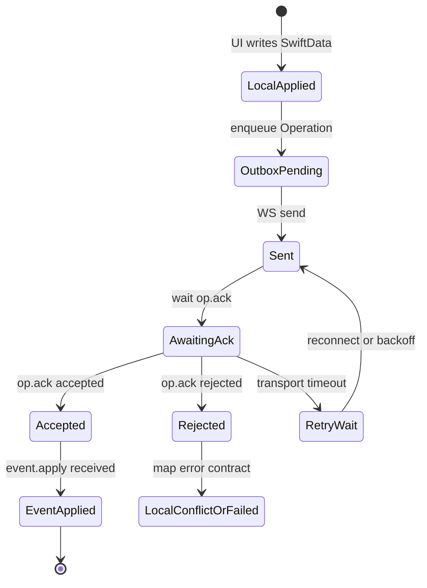
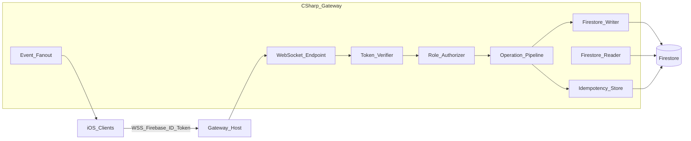

# FAZ 0 — Operation/Event + C# WebSocket Gateway Spec

| | |
|---|---|
| Status | Spec only (no production code) |
| Version | 0.1.0 |
| Date | 2026-08-24 |
| Scope (runtime later) | `customer`, `workOrder` |
| Deferred entities | `workOrderStatusHistory`, `workOrderNote`, `workOrderPhoto`, `workOrderLocation`, `signature`, `notification`, `editRequest` |

## Fixed decisions

- Spec is designed from scratch (no existing gateway/repo).
- **Firestore remains the source of truth.** The C# gateway reads/writes Firestore. No new backend database.
- Existing `SyncOperation` / `LocalToRemoteSyncManager` **stay in place**. FAZ 0 does not remove or modify them.
- Existing Firebase `customers` / `workOrders` documents are **not deleted**. No collection reset. No data migration wipe.
- Authentication: **Firebase Auth ID Token** → C# Gateway.
- Message examples: [OperationEventGateway-MessageExamples.md](./OperationEventGateway-MessageExamples.md).

### Non-goals for FAZ 0

- No Swift SyncManager / SyncQueue code changes.
- No C# project scaffold (starts in FAZ 1).
- No Firestore rules changes.
- No Firebase data writes/deletes from this phase.
- No WebSocket production client.

---

## 1. Operation / Event contract

### 1.1 Operation (client → gateway intent)

Offline-first mutation unit. Created on device, sent to the gateway, retained in a local outbox until ACK.

| Field | Type | Description |
|-------|------|-------------|
| `operationId` | UUID string | Client-generated, globally unique |
| `idempotencyKey` | string | Stable key: `{actorUid}:{entityType}:{entityId}:{opType}:{localVersion}` |
| `entityType` | enum | FAZ 1+: `customer` \| `workOrder` (later phases extend) |
| `entityId` | string | Domain ID (= Firestore document id) |
| `operationType` | enum | `create` \| `update` \| `delete` |
| `localVersion` | int | Client entity revision at enqueue time |
| `baseRemoteVersion` | int? | Last known remote version (optimistic concurrency); `null` on create |
| `actorUserId` | string | Firebase Auth UID |
| `deviceId` | string | Install-scoped device id |
| `clientTimestamp` | ISO-8601 | Client clock at enqueue |
| `payload` | object | Entity snapshot (FAZ 0 prefers **full snapshot**, not patch) |
| `dependsOnOperationId` | UUID? | Optional ordering (child entities in later phases) |

### 1.2 Event (gateway → clients fact)

Fact produced after the gateway accepts an Operation, applies it to Firestore, and fans it out.

| Field | Type | Description |
|-------|------|-------------|
| `eventId` | UUID string | Gateway-generated |
| `operationId` | UUID | Source Operation |
| `idempotencyKey` | string | Echo / dedupe |
| `entityType` | enum | |
| `entityId` | string | |
| `operationType` | enum | |
| `remoteVersion` | int | Version after Firestore write |
| `actorUserId` | string | |
| `serverTimestamp` | ISO-8601 | Gateway clock |
| `payload` | object | Canonical post-apply snapshot |
| `causation` | string | `accepted` \| `replay` \| `reconcile` |

### 1.3 Semantics

- UI/domain writes **SwiftData first** (unchanged product rule).
- “Remote success” is tied to **`op.ack` with `accepted`/`duplicate` and/or `event.apply`**, not to merely sending a frame.
- Local state is applied immediately; remote truth is confirmed by Event / ACK.

---

## 2. Event lifecycle



1. **Local apply** — existing use-case pattern (SwiftData first).
2. **Outbox** — Operation row in a **new** model (separate from `SyncOperation`; introduced in FAZ 1+).
3. **Send** — WebSocket `op.submit`.
4. **ACK** — `op.ack` (`accepted` / `rejected` / `duplicate`).
5. **Apply Event** — `event.apply` to the submitting client and peers; Firestore write already completed by the gateway.
6. **Reject** — map to local conflict/failed UI; **no** Firestore entity write.

---

## 3. ACK contract

Message type: `op.ack`

| Field | Description |
|-------|-------------|
| `operationId` | Correlates to submitted Operation |
| `idempotencyKey` | Echo of submit key |
| `status` | `accepted` \| `rejected` \| `duplicate` |
| `eventId` | Present when `accepted` or `duplicate` |
| `remoteVersion` | Present when `accepted` or `duplicate` |
| `error` | Present when `rejected` (see §4) |
| `serverTimestamp` | Gateway clock |

| Status | Meaning |
|--------|---------|
| `accepted` | New Event produced; Firestore write completed |
| `duplicate` | Same `idempotencyKey` was already accepted; echo existing Event metadata; **idempotent success**; no second entity write |
| `rejected` | No Firestore entity write; client marks outbox row failed (permanent or retryable per error) |

---

## 4. Error contract

Stable `code` + optional `message` + `retryable` boolean.

| code | retryable | Meaning |
|------|-----------|---------|
| `unauthorized` | false | Token missing/invalid/expired or actor spoof |
| `forbidden` | false | Role policy denial (e.g. operator-only create) |
| `notFound` | false | Entity missing remotely (update/delete) |
| `conflict` | false | `baseRemoteVersion` mismatch or business-rule conflict |
| `invalidPayload` | false | Schema / validation failure |
| `dependencyMissing` | true (until parent exists) | Parent work order not yet remote (FAZ 2+) |
| `unavailable` | true | Firestore or transient gateway failure |
| `rateLimited` | true | Back off and retry |
| `protocolError` | false | Malformed frame / unsupported version |

**Client mapping**

- `retryable == true` → keep outbox row; exponential backoff; resubmit **same** `idempotencyKey`.
- `retryable == false` → mark failed for UI/badge; **do not delete** the outbox row as a false success.

Error object shape:

```json
{
  "code": "conflict",
  "message": "baseRemoteVersion 3 != current 5",
  "retryable": false,
  "details": { }
}
```

---

## 5. Idempotency contract

1. Client **always** regenerates the same `idempotencyKey` for the same logical mutation (`actorUid:entityType:entityId:opType:localVersion`).
2. Gateway stores receipts in Firestore at `operationReceipts/{idempotencyKey}` (document id = key, or hashed if key length requires it) with at least:
   - `operationId`
   - `eventId`
   - `remoteVersion`
   - `status` (`accepted`)
   - `entityType`, `entityId`
   - `createdAt`
3. Resubmit of the same key → `op.ack` **`duplicate`** with the same `eventId` / `remoteVersion`; **no second entity write**.
4. Different `operationId` but same key → still **duplicate** (key wins).
5. Different keys racing on the same entity → resolved by `remoteVersion` / `conflict` (§11), not by silently dropping one write.

---

## 6. WebSocket message format

### 6.1 Envelope

JSON text frames only (no binary in FAZ 0):

```json
{
  "v": 1,
  "type": "hello | hello.ok | op.submit | op.ack | event.apply | ping | pong | error",
  "requestId": "uuid-optional",
  "payload": { }
}
```

| `type` | Direction | Payload |
|--------|-----------|---------|
| `hello` | client → server | `{ idToken, deviceId, protocolVersion, entitySubscriptions }` |
| `hello.ok` | server → client | `{ userId, role, serverTime, resumeToken? }` |
| `op.submit` | client → server | Operation object (§1.1) |
| `op.ack` | server → client | ACK object (§3) |
| `event.apply` | server → client | Event object (§1.2) |
| `ping` / `pong` | either | keepalive (`{ "t": <epochMs> }` optional) |
| `error` | server → client | protocol-level error (§4), often before close |

Max frame size and compression are deferred to FAZ 1.

### 6.2 Subscriptions (FAZ 1 scope)

`entitySubscriptions` for initial rollout: `["customer", "workOrder"]`.

---

## 7. Authentication / authorization contract

### 7.1 Authentication

1. iOS: `Auth.auth().currentUser.getIDToken()` → `hello.payload.idToken`.
2. Gateway: Firebase Admin SDK verifies the token → `uid` (+ claims).
3. Gateway reads Firestore `users/{uid}` → `role`, `isActive`.
4. Inactive or missing user profile → WebSocket close **4401** (or `error` then close).
5. Token expiry mid-session → `error` with `unauthorized` + close; client refreshes token and reconnects.
6. Every `op.submit`: `actorUserId` **must equal** verified token `uid`; otherwise `rejected` / `unauthorized`.

### 7.2 Authorization (documented intent for FAZ 1; not coded in FAZ 0)

Mirrors current product/rules intent for the first entity pair:

| Entity | Operation | Allowed roles |
|--------|-----------|---------------|
| `customer` | create / update | `operator` (admin policy to be confirmed in FAZ 1) |
| `workOrder` | create | `operator` |
| `workOrder` | update | `operator` (e.g. assign) **or** assigned `technician` (status machine) |
| `customer` / `workOrder` | delete | deferred / policy TBD in later phase |

Denial → `op.ack` `rejected` with `forbidden` (or `unauthorized` if session invalid).

---

## 8. Offline / reconnect behaviour

| Situation | Behaviour |
|-----------|-----------|
| Offline | Local SwiftData write + outbox enqueue; no WebSocket |
| Online | Connect → `hello` → `hello.ok` → flush outbox FIFO (prefer `customer` before dependent `workOrder` when both pending) |
| ACK timeout | Reconnect; **resubmit same `idempotencyKey`** (duplicate-safe) |
| Partial send | Do not delete local outbox; resubmit |
| Resume | Optional `resumeToken` / last `eventId` for catch-up (gateway read-through from Firestore). Reconnect **must not wipe** local SwiftData or Firestore |
| Badge (FAZ 1 UI) | Outbox pending + rejected counts; independent of legacy SyncQueue badge |

**Hard rules:** reconnect never resets Firestore collections; never resets the local store as a “fix”.

---

## 9. C# Gateway component architecture



### 9.1 Suggested projects (names only in FAZ 0; scaffold in FAZ 1)

| Project | Responsibility |
|---------|----------------|
| `Gateway.Host` | Kestrel host, WebSocket endpoint, DI wiring |
| `Gateway.Auth` | Firebase ID token verification |
| `Gateway.Operations` | Validate, authorize, idempotency, apply pipeline |
| `Gateway.Firestore` | Admin SDK access to `customers`, `workOrders`, `operationReceipts` |
| `Gateway.Realtime` | Connection registry, role/assignment-based fan-out |

### 9.2 Write path

1. Parse / validate envelope + Operation schema  
2. Idempotency lookup  
3. Authorize role + actor  
4. Firestore **transaction**: entity write + `operationReceipts` write  
5. Build Event  
6. Send `op.ack` to submitter  
7. Fan-out `event.apply` to eligible connections  

---

## 10. iOS client architecture (target for FAZ 1+; documentation only here)

New layers sit **beside** the existing SyncQueue (feature-flagged):

| Component | Role |
|-----------|------|
| `OperationOutbox` (SwiftData) | Separate from `SyncOperation` |
| `OperationSubmitting` | Protocol for enqueue + flush |
| `WebSocketGatewayClient` | `hello`, `op.submit`, handle `op.ack` / `event.apply` |
| `EventApplier` | Apply remote snapshot / version to local store; conflict policy |
| Feature flag `useOperationGateway` | Default **`false`** in FAZ 1; SyncManager path remains primary |

Future enqueue hooks (not in FAZ 0): `OperatorCustomerService`, `OperatorWorkOrderService` write to gateway outbox when the flag is on.

---

## 11. Firestore write / read responsibility

| Actor | Write | Read |
|-------|-------|------|
| **C# Gateway** | `customers`, `workOrders`, `operationReceipts` (later: child collections) | AuthZ, catch-up, fan-out hydration |
| **iOS legacy SyncQueue** | Existing path remains available through FAZ 1–2 | Existing Firebase repositories |
| **iOS gateway mode** | **No direct entity writes** to Firestore (Storage uploads deferred) | Local SwiftData + gateway events; optional read-through via gateway |
| **Firestore Security Rules** | **Unchanged in FAZ 0.** Gateway uses Admin SDK (bypasses rules). Legacy client writes keep current rules |

### 11.1 Versioning

- Entity documents carry `remoteVersion` (int).
- Each accepted gateway write increments `remoteVersion` by 1.
- Client sends `baseRemoteVersion` on update/delete.
- If `baseRemoteVersion != current` → `op.ack` `rejected` with `conflict`.

### 11.2 Data safety

- Do **not** delete or rewrite existing customer/workOrder IDs.
- Do **not** reset collections.
- Do **not** invent a parallel ID space.

---

## 12. Migration / rollback strategy

### 12.1 Migration (no data loss)

| Phase | Action |
|-------|--------|
| **FAZ 0** | Spec only (this document) |
| **FAZ 1** | Gateway + iOS client behind flag; **SyncQueue remains primary** |
| **FAZ 1.5** | Optional dual-submit **shadow** (log-only); no production dual-write of entities |
| **FAZ 2** | Enable flag for operator `customer` / `workOrder` on staging |
| **FAZ 3+** | Child entity types; gradually stop SyncQueue enqueue for those types |
| **FAZ N** | SyncQueue drain-only / deprecate **only after** queue empty and gateway stable |

### 12.2 Rollback

- Feature flag **off** → new mutations use SyncQueue again.
- Gateway down → gateway outbox accumulates; if SyncQueue path is still enabled, legacy drain continues.
- **Never:** Firestore reset, local store reset, bulk delete of business documents.

### 12.3 Coexistence rule

Writing the same entity from both SyncQueue and Gateway risks conflicts.

**Production rule (from FAZ 1):** **single writer per `entityType`** via feature flag — for `customer` / `workOrder`, either SyncQueue **or** Gateway, not both.

---

## Roadmap (outside FAZ 0 delivery)

- **FAZ 1:** C# gateway skeleton, Firebase token auth, `customer`/`workOrder` apply, iOS outbox + WS behind flag **OFF**
- **FAZ 2:** Staging flag ON; E2E; badge integration
- **FAZ 3:** Child entity types
- **FAZ 4:** SyncQueue deprecation (drain-only)

---

## Related documents

- [Message examples](./OperationEventGateway-MessageExamples.md)
- [Architecture index](./README.md)
- Existing overview PDF: [`../DonanimOperasyonServis-Mimari-Ozet.pdf`](../DonanimOperasyonServis-Mimari-Ozet.pdf) (current SyncQueue + Firebase architecture)
